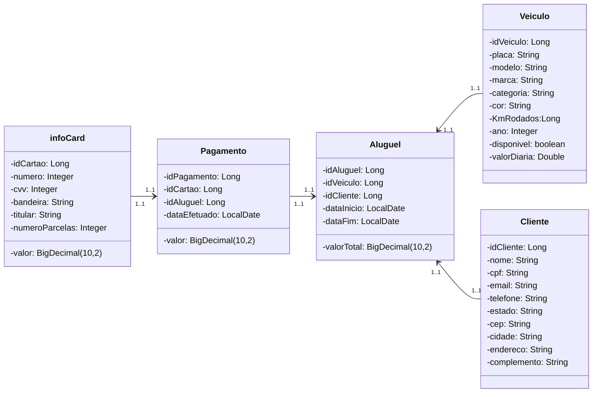

# Desafio_1_Avanade

Publicando minha API REST na Nuvem Usando Spring Boot 3.4.4, Java 21 e Railway 2025.

 ### Sobre a API
A API permite o gerenciamento de registro de alugueis de veiculos, informações dos cartões e veiculos disponiveis no sitema. A seguir, um diagrama de classes representando o sistema.

## Diagrama de Classe (Domínio da API)



### Mapa de Camadas

No meu projeto Spring Boot, as camadas podem ser mapeadas da seguinte forma:

Camada de Apresentação (AluguelController): Responsável por receber as requisições HTTP e retornar as respostas 
apropriadas.

Camada de Serviço (AluguelServiceImpl): Contém a lógica de negócio, processando as informações recebidas da camada 
de apresentação e interagindo com a camada de persistência.

Camada de Persistência (AlguelService): Gerencia a comunicação com o banco de dados, realizando 
operações de CRUD (Create, Read, Update, Delete).

Camada de Modelo (Package = domain --> model): Define as entidades e seus atributos, representando as tabelas do 
banco de dados.

### Deploy no Railway

A API está hospedada no Railway. Para acessar, utilize:
```
vibrant-clarity-production.up.railway.app
```  

## 📌 Endpoints

| Método | Endpoint       | Descrição                           |
|--------|----------------|-----------------------------------|
| `GET`  | `/alugueis`    | Retorna um registro de aluguel através do id        |
| `DELETE` | `/alugueis`  | Deleta o registro de aluguel através do id        |
| `POST`  | `/alugueis`    | Atualiza um registro de aluguel pelo id       |
| `CREATE` | `/alugueis`    | Cria um novo registro            |

