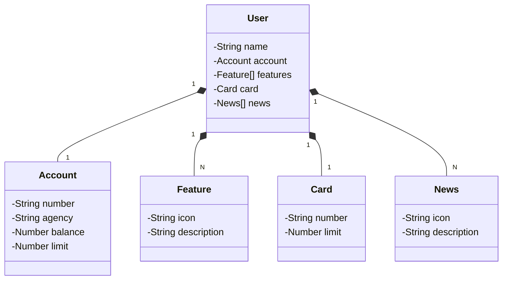

### Java RESTful API com deploy no Railway
Este projeto é uma API RESTful desenvolvida em Java e Spring Boot, com persistência de dados utilizando Spring Data JPA e documentação via Swagger (OpenAPI). O deploy da API é realizado na plataforma Railway.

### Principais Tecnologias
 - **Java 17**;
 - **Spring Boot 3.4.3**;
 - **Spring Data JPA**;
 - **OpenAPI (Swagger)**;
 - **Railway**

### Sobre a API
A API permite o gerenciamento de usuários, contas bancárias, cartões e funcionalidades associadas. A seguir, um diagrama de classes representando o domínio do sistema.

### Mapa de Camadas

No meu projeto Spring Boot, as camadas podem ser mapeadas da seguinte forma:

Camada de Apresentação (AluguelController): Responsável por receber as requisições HTTP e retornar as respostas 
apropriadas.

Camada de Serviço (AluguelServiceImpl): Contém a lógica de negócio, processando as informações recebidas da camada 
de apresentação e interagindo com a camada de persistência.

Camada de Persistência (AlguelService): Gerencia a comunicação com o banco de dados, realizando 
operações de CRUD (Create, Read, Update, Delete).

Camada de Modelo (Package = domain --> model): Define as entidades e seus atributos, representando as tabelas do 
banco de dados.

### Diagrama de Classes (Domínio da API)



### Deploy no Railway  

A API está hospedada no Railway. Para acessar, utilize:  
```
vibrant-clarity-production.up.railway.app
```  

## 📌 Endpoints Principais  

| Método | Endpoint         | Descrição                           |
|--------|----------------|-----------------------------------|
| `GET`  | `/users`       | Retorna todos os usuários        |
| `POST` | `/users`       | Cria um novo usuário             |
| `GET`  | `/accounts`    | Retorna todas as contas          |
| `POST` | `/accounts`    | Cria uma nova conta              |
